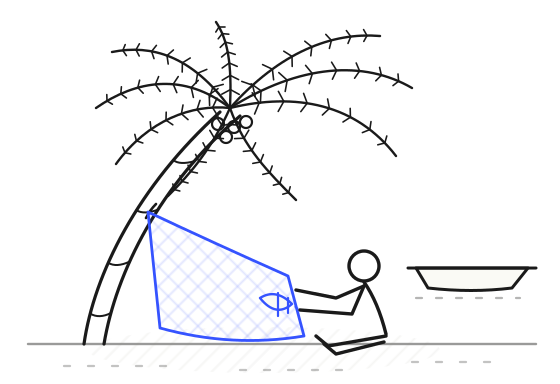
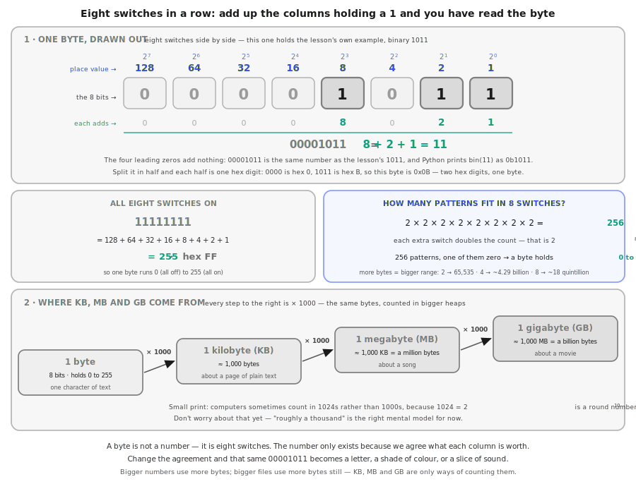
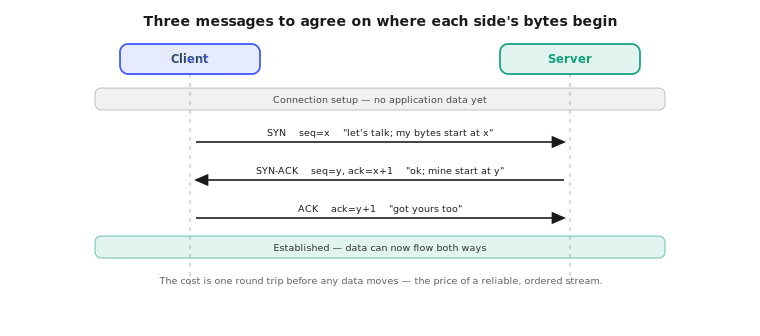
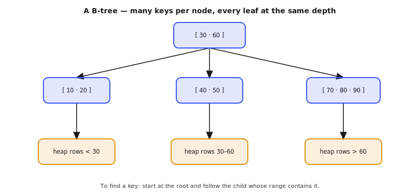

<div align="center">

<picture>
  <source media="(prefers-color-scheme: dark)" srcset="assets/fig-01-the-mend-dark.svg">
  
</picture>

# Building Backend

**_"When fishermen cannot go to sea, they repair nets."_**

Learn how backends actually work, starting from zero.<br>
**164 lessons · 13 phases · Python, standard library only.**

Free. Open source. MIT. No paywall, no signup, no gated content.

[**Read it →**](https://buildingbackend.vercel.app) &nbsp;·&nbsp; [Catalog](https://buildingbackend.vercel.app/catalog) &nbsp;·&nbsp; [Roadmap](https://buildingbackend.vercel.app/roadmap) &nbsp;·&nbsp; [Jargon](https://buildingbackend.vercel.app/jargon)

</div>

---

## Why this exists

Almost everyone starts with AI now. It is the first thing people reach for, and it is
where most learning paths begin. I think that is backwards. AI sits on top of a very
tall stack, and if you start at the top you never learn what is holding you up.

You cannot skip the bottom rungs of a ladder and land on the top one. You go up a step
at a time. That means starting at zero, with the things nobody shows you: what is
actually happening behind the scenes, what the machine is really doing, what the
infrastructure underneath is for.

Get through that and AI is a fine place to end up. By then you will know what it is
standing on.

This is not a mastery program and it does not promise to make you an expert. If it
leaves you more curious about how backends work than when you arrived, it did its job.

## How a lesson works

Every lesson runs the same loop. The **Build It / Use It** split is the spine: you
implement the primitive from raw bytes first, then run the same thing through the
production tool. You understand what the tool does because you wrote the smaller
version yourself.

```
MOTTO → PROBLEM → CONCEPT → BUILD IT (from raw bytes) → USE IT (real tool) → SHIP IT (artifact)
```

Each lesson lives in its own folder, same structure across the whole curriculum:

```
phases/<NN>-<phase-name>/<NN>-<lesson-name>/
├── code/      runnable implementations (Python, standard library only)
├── docs/
│   └── en.md  the lesson itself
└── outputs/   a checklist, runbook, or prompt you keep
```

That last folder matters. **134 artifacts** so far: 88 checklists, 31 runbooks,
15 prompts. Things you can take to real work.

## A glimpse

Every diagram is hand-drawn SVG, built to show the thing rather than decorate the page.
Three, from opposite ends of the curriculum.

<br>

**Phase 0 · Bits & Bytes** — the same byte, read two different ways.

<picture>
  <source media="(prefers-color-scheme: dark)" srcset="assets/diagram-bits-and-bytes-dark.svg">
  
</picture>

<br>

**Phase 1 · Transport Layer** — why a TCP connection costs a round trip before any data moves.

<picture>
  <source media="(prefers-color-scheme: dark)" srcset="assets/diagram-tcp-handshake-dark.svg">
  
</picture>

<br>

**Phase 3 · Indexes & the B-Tree** — the structure under every database index you have ever used.

<picture>
  <source media="(prefers-color-scheme: dark)" srcset="assets/diagram-btree-dark.svg">
  
</picture>

## Getting started

Nothing to install. Every lesson is Python, standard library only.

```bash
git clone https://github.com/ritikshub/buildingbackend.git
cd buildingbackend
python3 phases/01-networking-and-protocols/05-transport-layer-tcp-vs-udp/code/tcp_echo.py
# starts a TCP server, runs a client against it, prints the exchange, and exits
```

You need to be able to write code in at least one language, and to want to know how
backends **actually work** rather than which framework method to call. That is all.

## Experiment sandbox (Docker)

Some lessons are more fun with a real Postgres and Redis to point at. This gives you
both in a throwaway container, with nothing installed on your machine:

```bash
make up      # build + start app, postgres, redis  (first run ~2 min)
make shell   # open a shell inside the sandbox
make down    # stop  (make clean also wipes the db volume)
```

The repo is mounted live at `/workspace`, so you edit on your machine and run in the
container. Postgres and Redis are published on non-standard ports (`55432`, `63790`)
so the sandbox never collides with anything you already run. `make help` lists the rest.


---

<a id="contents"></a>

## Contents

Thirteen phases, all written, plus five capstone projects still to come. Click any
phase to expand its lesson list.

<a id="phase-0"></a>
### Phase 0: Foundations `11 lessons`
> How the machine actually works — from a single bit, through the transistors and chips that run your code, to the memory and files it uses. Zero assumptions.

| # | Lesson | Type | Lang |
|:---:|--------|:----:|------|
| 01 | [Bits & Bytes](phases/00-foundations/01-bits-and-bytes/) | Learn | Python |
| 02 | [Text & Encoding](phases/00-foundations/02-text-and-encoding/) | Learn | Python |
| 03 | [Transistors & Logic Gates](phases/00-foundations/03-transistors-and-logic-gates/) | Build | Python |
| 04 | [From Sand to Chip](phases/00-foundations/04-from-sand-to-chip/) | Learn | — |
| 05 | [The CPU](phases/00-foundations/05-the-cpu/) | Build | Python |
| 06 | [Memory Hierarchy](phases/00-foundations/06-ram-and-memory-hierarchy/) | Build | Python |
| 07 | [The GPU](phases/00-foundations/07-the-gpu/) | Learn | — |
| 08 | [Comparing Hardware](phases/00-foundations/08-comparing-hardware/) | Build | Python |
| 09 | [Running a Program](phases/00-foundations/09-how-a-computer-runs-a-program/) | Learn | Python |
| 10 | [Files & the Filesystem](phases/00-foundations/10-files-and-the-filesystem/) | Learn | Python |
| 11 | [What a Network Is](phases/00-foundations/11-what-a-network-is/) | Learn | — |

<details id="phase-1">
<summary><b>Phase 1 — Networking and Protocols</b> &nbsp;<code>14 lessons</code>&nbsp; <em>Bottom-up: from topology and cables at the physical layer up to HTTP, TLS, and the protocols above them.</em></summary>
<br/>

| # | Lesson | Type | Lang |
|:---:|--------|:----:|------|
| 01 | [The Two Maps: OSI & TCP/IP Models](phases/01-networking-and-protocols/01-osi-and-tcp-ip-models/) | Build | Python |
| 02 | [Physical Layer: Topologies, Cables & Signals](phases/01-networking-and-protocols/02-physical-layer-topologies-cables-signals/) | Build | Python |
| 03 | [Data Link Layer: MAC, Frames & Switching](phases/01-networking-and-protocols/03-data-link-mac-frames-switching/) | Build | Python |
| 04 | [Network Layer: IP, Subnets & Routing](phases/01-networking-and-protocols/04-network-layer-ip-subnets-routing/) | Build | Python |
| 05 | [Transport Layer: TCP vs UDP](phases/01-networking-and-protocols/05-transport-layer-tcp-vs-udp/) | Build | Python |
| 06 | [Names on the Network: DNS](phases/01-networking-and-protocols/06-dns-names-on-the-network/) | Build | Python |
| 07 | [Application Layer: Protocols & Ports](phases/01-networking-and-protocols/07-application-layer-protocols-and-ports/) | Build | Python |
| 08 | [HTTP in Depth: Methods, Status, Headers, Keep-Alive](phases/01-networking-and-protocols/08-http-in-depth/) | Build | Python |
| 09 | [HTTP Server from a TCP Socket](phases/01-networking-and-protocols/09-http-server-from-tcp/) | Build | Python |
| 10 | [TLS, Certificates & mTLS](phases/01-networking-and-protocols/10-tls-certificates-mtls/) | Build | Python |
| 11 | [HTTP/2 & HTTP/3 (QUIC)](phases/01-networking-and-protocols/11-http2-and-http3-quic/) | Build | Python |
| 12 | [WebSockets & Server-Sent Events](phases/01-networking-and-protocols/12-websockets-and-sse/) | Build | Python |
| 13 | [gRPC & Protocol Buffers](phases/01-networking-and-protocols/13-grpc-and-protocol-buffers/) | Build | Python |
| 14 | [Keep-Alive, Connection Pooling & Timeouts](phases/01-networking-and-protocols/14-keep-alive-pooling-timeouts/) | Build | Python |

</details>

<details id="phase-2">
<summary><b>Phase 2 — API Design</b> &nbsp;<code>10 lessons</code>&nbsp; <em>Contracts humans and machines can both rely on.</em></summary>
<br/>

| # | Lesson | Type | Lang |
|:---:|--------|:----:|------|
| 01 | [REST Principles & Resource Modeling](phases/02-api-design/01-rest-principles-resource-modeling/) | Learn | — |
| 02 | [URLs, Verbs & Status Codes](phases/02-api-design/02-urls-verbs-status-codes/) | Build | Python |
| 03 | [Request Validation & Error Contracts](phases/02-api-design/03-request-validation-error-contracts/) | Build | Python |
| 04 | [Pagination, Filtering & Sorting](phases/02-api-design/04-pagination-filtering-sorting/) | Build | Python |
| 05 | [API Versioning Strategies](phases/02-api-design/05-api-versioning/) | Learn | — |
| 06 | [OpenAPI & Contract-First Design](phases/02-api-design/06-openapi-contract-first/) | Build | Python |
| 07 | [Idempotency & Safe Retries](phases/02-api-design/07-idempotency-safe-retries/) | Build | Python |
| 08 | [GraphQL from Scratch](phases/02-api-design/08-graphql-from-scratch/) | Build | Python |
| 09 | [Rate Limiting & Quotas](phases/02-api-design/09-rate-limiting-quotas/) | Build | Python |
| 10 | [API Gateways & the BFF Pattern](phases/02-api-design/10-api-gateways-bff/) | Learn | — |

</details>

<details id="phase-3">
<summary><b>Phase 3 — Relational Databases</b> &nbsp;<code>16 lessons</code>&nbsp; <em>From "why persistence?" to a working engine: the relational model, schema, indexes, transactions, and the B-tree under all of them.</em></summary>
<br/>

| # | Lesson | Type | Lang |
|:---:|--------|:----:|------|
| 01 | [Why Databases Exist: Persistence & the Limits of Files](phases/03-relational-databases/01-why-databases-exist/) | Learn | — |
| 02 | [A Field Guide to Databases: Types & Trade-offs](phases/03-relational-databases/02-database-landscape/) | Learn | — |
| 03 | [The Relational Model](phases/03-relational-databases/03-the-relational-model/) | Learn | SQL |
| 04 | [Tables, Columns & Data Types](phases/03-relational-databases/04-tables-columns-data-types/) | Learn | SQL |
| 05 | [Keys & Relationships](phases/03-relational-databases/05-keys-and-relationships/) | Learn | SQL |
| 06 | [Constraints & Data Integrity](phases/03-relational-databases/06-constraints-and-integrity/) | Learn | SQL |
| 07 | [Schema Design & Normalization](phases/03-relational-databases/07-schema-design-and-normalization/) | Learn | SQL |
| 08 | [How Data Lives on Disk: Pages, Heaps & the Buffer Pool](phases/03-relational-databases/08-storage-pages-and-heaps/) | Build | Python |
| 09 | [Indexes & the B-Tree](phases/03-relational-databases/09-indexes-and-the-btree/) | Build | Python |
| 10 | [How Queries Run: The Planner & EXPLAIN](phases/03-relational-databases/10-query-planning-and-explain/) | Learn | SQL |
| 11 | [Transactions & ACID](phases/03-relational-databases/11-transactions-and-acid/) | Build | Python |
| 12 | [Isolation, Concurrency & MVCC](phases/03-relational-databases/12-isolation-levels-and-mvcc/) | Learn | — |
| 13 | [Durability: Write-Ahead Logging](phases/03-relational-databases/13-write-ahead-logging/) | Build | Python |
| 14 | [Connection Pooling & the N+1 Problem](phases/03-relational-databases/14-connection-pooling-and-n-plus-1/) | Build | Python |
| 15 | [Migrations & Schema Evolution](phases/03-relational-databases/15-migrations-and-schema-evolution/) | Build | Python |
| 16 | [Capstone: A Mini Relational Engine on a B-Tree](phases/03-relational-databases/16-mini-relational-engine/) | Build | Python |

</details>

<details id="phase-4">
<summary><b>Phase 4 — NoSQL and Data Modeling</b> &nbsp;<code>8 lessons</code>&nbsp; <em>When the relational model isn't the right shape.</em></summary>
<br/>

| # | Lesson | Type | Lang |
|:---:|--------|:----:|------|
| 01 | [When Not to Use SQL](phases/04-nosql-and-data-modeling/01-when-not-to-use-sql/) | Learn | — |
| 02 | [Key-Value Stores](phases/04-nosql-and-data-modeling/02-key-value-stores/) | Build | Python |
| 03 | [Document Databases](phases/04-nosql-and-data-modeling/03-document-databases/) | Build | Python |
| 04 | [Wide-Column Stores](phases/04-nosql-and-data-modeling/04-wide-column-stores/) | Learn | — |
| 05 | [Time-Series Databases](phases/04-nosql-and-data-modeling/05-time-series-databases/) | Build | Python |
| 06 | [Graph Databases](phases/04-nosql-and-data-modeling/06-graph-databases/) | Build | Python |
| 07 | [Data Modeling by Access Pattern](phases/04-nosql-and-data-modeling/07-data-modeling-by-access-pattern/) | Build | Python |
| 08 | [Polyglot Persistence](phases/04-nosql-and-data-modeling/08-polyglot-persistence/) | Learn | — |

</details>

<details id="phase-5">
<summary><b>Phase 5 — Caching</b> &nbsp;<code>8 lessons</code>&nbsp; <em>The fastest query is the one you never run.</em></summary>
<br/>

| # | Lesson | Type | Lang |
|:---:|--------|:----:|------|
| 01 | [Why & Where to Cache](phases/05-caching/01-why-and-where-to-cache/) | Learn | — |
| 02 | [Build an LRU Cache](phases/05-caching/02-build-an-lru-cache/) | Build | Python |
| 03 | [Redis Fundamentals](phases/05-caching/03-redis-fundamentals/) | Build | Python |
| 04 | [Cache Strategies: Aside, Through, Behind](phases/05-caching/04-cache-strategies/) | Build | Python |
| 05 | [Invalidation & TTLs](phases/05-caching/05-invalidation-and-ttls/) | Build | Python |
| 06 | [Cache Stampede & the Thundering Herd](phases/05-caching/06-cache-stampede/) | Build | Python |
| 07 | [CDNs & Edge Caching](phases/05-caching/07-cdns-and-edge-caching/) | Learn | — |
| 08 | [HTTP Caching & ETags](phases/05-caching/08-http-caching-and-etags/) | Build | Python |

</details>

<details id="phase-6">
<summary><b>Phase 6 — Messaging and Pub/Sub</b> &nbsp;<code>13 lessons</code>&nbsp; <em>Decouple services with queues, topics, logs, and events.</em></summary>
<br/>

Tool-agnostic by design. You build the queue, the topic, and the log by hand,
then meet RabbitMQ, Kafka, SQS and NATS as *examples* of those three shapes —
never as chapters of their own.

| # | Lesson | Type | Lang |
|:---:|--------|:----:|------|
| 01 | [Why Async? Coupling & the Cost of the Direct Call](phases/06-messaging-and-pub-sub/01-why-async-and-the-cost-of-coupling/) | Learn | — |
| 02 | [Anatomy of a Message: Envelope, Payload & Serialization](phases/06-messaging-and-pub-sub/02-anatomy-of-a-message/) | Build | Python |
| 03 | [Build a Message Queue: Work Distribution & Acknowledgement](phases/06-messaging-and-pub-sub/03-build-a-message-queue/) | Build | Python |
| 04 | [Pub/Sub: Topics, Subscriptions & Fan-Out](phases/06-messaging-and-pub-sub/04-pub-sub-topics-and-fan-out/) | Build | Python |
| 05 | [The Log: Offsets, Replay & Retention](phases/06-messaging-and-pub-sub/05-the-log-offsets-and-replay/) | Build | Python |
| 06 | [Delivery Semantics & Idempotent Consumers](phases/06-messaging-and-pub-sub/06-delivery-semantics-and-idempotency/) | Build | Python |
| 07 | [Ordering, Partition Keys & Parallel Consumers](phases/06-messaging-and-pub-sub/07-ordering-partition-keys-and-parallel-consumers/) | Build | Python |
| 08 | [Retries, Backoff, Dead-Letter Queues & Poison Messages](phases/06-messaging-and-pub-sub/08-retries-backoff-and-dead-letter-queues/) | Build | Python |
| 09 | [Backpressure, Consumer Lag & Flow Control](phases/06-messaging-and-pub-sub/09-backpressure-lag-and-flow-control/) | Build | Python |
| 10 | [The Dual-Write Problem: Transactional Outbox & CDC](phases/06-messaging-and-pub-sub/10-dual-write-outbox-and-cdc/) | Build | Python |
| 11 | [Event-Driven Architecture: Commands, Choreography & Sagas](phases/06-messaging-and-pub-sub/11-event-driven-architecture/) | Learn | — |
| 12 | [Schema Evolution & Event Contracts](phases/06-messaging-and-pub-sub/12-schema-evolution-and-event-contracts/) | Build | Python |
| 13 | [Capstone: An Event-Driven Order Pipeline, End to End](phases/06-messaging-and-pub-sub/13-capstone-event-driven-order-pipeline/) | Build | Python |

</details>

<details id="phase-7">
<summary><b>Phase 7 — Auth and Security</b> &nbsp;<code>13 lessons</code>&nbsp; <em>Who are you, what may you do, and how do we not leak it.</em></summary>
<br/>

| # | Lesson | Type | Lang |
|:---:|--------|:----:|------|
| 01 | [Authentication, Authorization & the Security Mindset](phases/07-auth-and-security/01-authn-authz-and-the-security-mindset/) | Learn | — |
| 02 | [Cryptographic Building Blocks](phases/07-auth-and-security/02-cryptographic-building-blocks/) | Build | Python |
| 03 | [Password Storage & Hashing (bcrypt, argon2)](phases/07-auth-and-security/03-password-storage-and-hashing/) | Build | Python |
| 04 | [Multi-Factor Auth: TOTP & Passkeys (WebAuthn)](phases/07-auth-and-security/04-multi-factor-auth-totp-and-passkeys/) | Build | Python |
| 05 | [Sessions & Secure Cookies](phases/07-auth-and-security/05-sessions-and-secure-cookies/) | Build | Python |
| 06 | [JWT & Token Auth from Scratch](phases/07-auth-and-security/06-jwt-and-token-auth/) | Build | Python |
| 07 | [OAuth 2.0 & OIDC](phases/07-auth-and-security/07-oauth2-and-oidc/) | Build | Python |
| 08 | [API Keys, HMAC Signing & Webhooks](phases/07-auth-and-security/08-api-keys-hmac-and-webhooks/) | Build | Python |
| 09 | [Authorization: RBAC, ABAC & ReBAC](phases/07-auth-and-security/09-authorization-rbac-abac-rebac/) | Build | Python |
| 10 | [The Browser Trust Boundary: CORS, CSRF & XSS](phases/07-auth-and-security/10-browser-trust-boundary-cors-csrf-xss/) | Build | Python |
| 11 | [Injection & the OWASP Top 10 for Backends](phases/07-auth-and-security/11-injection-and-owasp-top-10/) | Build | Python |
| 12 | [Abuse Prevention: Bots, Credential Stuffing & Account Takeover](phases/07-auth-and-security/12-abuse-prevention/) | Build | Python |
| 13 | [Secrets Management & Rotation](phases/07-auth-and-security/13-secrets-management-and-rotation/) | Build | Python |

</details>

<details id="phase-8">
<summary><b>Phase 8 — Concurrency and Performance</b> &nbsp;<code>15 lessons</code>&nbsp; <em>Do many things at once without corrupting any of them.</em></summary>
<br/>

| # | Lesson | Type | Lang |
|:---:|--------|:----:|------|
| 01 | [Why Concurrency? Latency, Throughput & Little's Law](phases/08-concurrency-and-performance/01-why-concurrency/) | Build | Python |
| 02 | [Processes, Threads & the GIL](phases/08-concurrency-and-performance/02-processes-threads-and-the-gil/) | Build | Python |
| 03 | [Blocking vs Non-Blocking I/O: select, poll & epoll](phases/08-concurrency-and-performance/03-blocking-vs-non-blocking-io/) | Build | Python |
| 04 | [The Event Loop: Build a Reactor from Scratch](phases/08-concurrency-and-performance/04-the-event-loop/) | Build | Python |
| 05 | [Coroutines & Async/Await from the Ground Up](phases/08-concurrency-and-performance/05-coroutines-and-async-await/) | Build | Python |
| 06 | [Structured Concurrency: Tasks, Cancellation & Timeouts](phases/08-concurrency-and-performance/06-structured-concurrency-and-cancellation/) | Build | Python |
| 07 | [Thread Pools, Work Queues & Executors](phases/08-concurrency-and-performance/07-thread-pools-and-work-queues/) | Build | Python |
| 08 | [Race Conditions, Atomicity & Critical Sections](phases/08-concurrency-and-performance/08-race-conditions-and-atomicity/) | Build | Python |
| 09 | [Locks & Coordination Primitives](phases/08-concurrency-and-performance/09-locks-and-coordination-primitives/) | Build | Python |
| 10 | [Deadlock, Livelock & Starvation](phases/08-concurrency-and-performance/10-deadlock-livelock-and-starvation/) | Build | Python |
| 11 | [Backpressure, Queueing & Load Shedding](phases/08-concurrency-and-performance/11-backpressure-and-load-shedding/) | Build | Python |
| 12 | [Connection & Resource Pooling](phases/08-concurrency-and-performance/12-connection-and-resource-pooling/) | Build | Python |
| 13 | [Profiling: Finding the Real Bottleneck](phases/08-concurrency-and-performance/13-profiling/) | Build | Python |
| 14 | [Benchmarking & Load Testing: Numbers You Can Trust](phases/08-concurrency-and-performance/14-benchmarking-and-load-testing/) | Build | Python |
| 15 | [Capstone: Make a Slow Service Fast](phases/08-concurrency-and-performance/15-capstone-make-a-slow-service-fast/) | Build | Python |

</details>

<details id="phase-9">
<summary><b>Phase 9 — Logging, Monitoring and Observability</b> &nbsp;<code>12 lessons</code>&nbsp; <em>You can't fix what you can't see.</em></summary>
<br/>

| # | Lesson | Type | Lang |
|:---:|--------|:----:|------|
| 01 | [Why Systems Go Dark: Monitoring, Observability & the Three Pillars](phases/09-logging-monitoring-and-observability/01-why-systems-go-dark/) | Learn | — |
| 02 | [Logs: From print() to Structured Events](phases/09-logging-monitoring-and-observability/02-structured-logging/) | Build | Python |
| 03 | [Correlation: Request IDs, Trace Context & Propagation](phases/09-logging-monitoring-and-observability/03-correlation-and-request-context/) | Build | Python |
| 04 | [The Log Pipeline: Ship, Store, Query — and What It Costs](phases/09-logging-monitoring-and-observability/04-the-log-pipeline/) | Build | Python |
| 05 | [Metrics: Counters, Gauges & Histograms from Scratch](phases/09-logging-monitoring-and-observability/05-metrics-from-scratch/) | Build | Python |
| 06 | [Prometheus: Pull, Exposition & PromQL](phases/09-logging-monitoring-and-observability/06-prometheus-and-promql/) | Build | Python |
| 07 | [Distributed Tracing & OpenTelemetry](phases/09-logging-monitoring-and-observability/07-distributed-tracing-and-opentelemetry/) | Build | Python |
| 08 | [Health Checks, Readiness & Graceful Shutdown](phases/09-logging-monitoring-and-observability/08-health-checks-and-probes/) | Build | Python |
| 09 | [SLIs, SLOs & Error Budgets](phases/09-logging-monitoring-and-observability/09-slis-slos-and-error-budgets/) | Learn | — |
| 10 | [Alerting & On-Call That Doesn't Burn People Out](phases/09-logging-monitoring-and-observability/10-alerting-and-on-call/) | Learn | — |
| 11 | [Dashboards: RED, USE & Grafana](phases/09-logging-monitoring-and-observability/11-dashboards-red-and-use/) | Build | Python |
| 12 | [Capstone: Debugging a Real Incident](phases/09-logging-monitoring-and-observability/12-capstone-debugging-an-incident/) | Build | Python |

</details>

<details id="phase-10">
<summary><b>Phase 10 — Infrastructure and Deployment</b> &nbsp;<code>15 lessons</code>&nbsp; <em>From "it works on my laptop" to a fleet you can change at 3pm on a Tuesday: containers built from kernel primitives up, declared infrastructure, orchestration, pipelines, and every safe way to land a change.</em></summary>
<br/>

| # | Lesson | Type | Lang |
|:---:|--------|:----:|------|
| 01 | [Where Code Actually Runs: Bare Metal, VMs, Containers & Serverless](phases/10-infrastructure-and-deployment/01-where-code-actually-runs/) | Learn | Python |
| 02 | [What a Container Actually Is: Namespaces, cgroups & Layers](phases/10-infrastructure-and-deployment/02-what-a-container-actually-is/) | Build | Python |
| 03 | [Images, Layers & the Reproducible Build](phases/10-infrastructure-and-deployment/03-images-layers-and-builds/) | Build | Python |
| 04 | [Registries, Digests & the Software Supply Chain](phases/10-infrastructure-and-deployment/04-registries-and-supply-chain/) | Build | Python |
| 05 | [Config, Environments & the Twelve-Factor App](phases/10-infrastructure-and-deployment/05-config-and-twelve-factor/) | Build | Python |
| 06 | [Infrastructure as Code: Desired State, Plan, Apply & Drift](phases/10-infrastructure-and-deployment/06-infrastructure-as-code/) | Build | Python |
| 07 | [Orchestration: Control Loops, Schedulers & Kubernetes](phases/10-infrastructure-and-deployment/07-orchestration-and-kubernetes/) | Build | Python |
| 08 | [Service Discovery & Health-Aware Routing](phases/10-infrastructure-and-deployment/08-service-discovery-and-routing/) | Build | Python |
| 09 | [Reverse Proxies, Load Balancers & Ingress](phases/10-infrastructure-and-deployment/09-reverse-proxies-and-load-balancers/) | Build | Python |
| 10 | [CI/CD: From Commit to Artifact to Environment](phases/10-infrastructure-and-deployment/10-ci-cd-pipelines/) | Build | Python |
| 11 | [Deployment Strategies: Rolling, Blue-Green & Canary](phases/10-infrastructure-and-deployment/11-deployment-strategies/) | Build | Python |
| 12 | [Deploy ≠ Release: Feature Flags & Progressive Delivery](phases/10-infrastructure-and-deployment/12-deploy-vs-release-feature-flags/) | Build | Python |
| 13 | [Zero-Downtime Schema & Contract Changes](phases/10-infrastructure-and-deployment/13-zero-downtime-schema-changes/) | Build | Python |
| 14 | [Rollback, Backups & Disaster Recovery](phases/10-infrastructure-and-deployment/14-rollback-backups-and-disaster-recovery/) | Build | Python |
| 15 | [Capstone: Ship a Service End to End](phases/10-infrastructure-and-deployment/15-capstone-ship-a-service/) | Build | Python |

</details>

<details id="phase-11">
<summary><b>Phase 11 — Scalability and Reliability</b> &nbsp;<code>14 lessons</code>&nbsp; <em>From the honest ceiling of one machine to a fleet that survives losing a region: the law that bounds it, the routing that feeds it, the data tier under it, and the failures it is built to absorb.</em></summary>
<br/>

| # | Lesson | Type | Lang |
|:---:|--------|:----:|------|
| 01 | [What One Machine Can Actually Do](phases/11-scalability-and-reliability/01-what-one-machine-can-do/) | Build | Python |
| 02 | [The Universal Scalability Law: Why 2× the Machines Isn't 2× the Throughput](phases/11-scalability-and-reliability/02-universal-scalability-law/) | Build | Python |
| 03 | [Load Balancing Algorithms: Why Round-Robin Lies](phases/11-scalability-and-reliability/03-load-balancing-algorithms/) | Build | Python |
| 04 | [Layer 4 vs Layer 7, Health Checks & Outlier Ejection](phases/11-scalability-and-reliability/04-l4-l7-health-checks-and-ejection/) | Build | Python |
| 05 | [Service Discovery, Client-Side Balancing & Subsetting](phases/11-scalability-and-reliability/05-service-discovery-and-subsetting/) | Build | Python |
| 06 | [Stateless Services: Where the State Actually Went](phases/11-scalability-and-reliability/06-stateless-services/) | Build | Python |
| 07 | [Read Replicas & Replication Lag](phases/11-scalability-and-reliability/07-read-replicas-and-replication-lag/) | Build | Python |
| 08 | [Sharding the Data Tier](phases/11-scalability-and-reliability/08-sharding-the-data-tier/) | Build | Python |
| 09 | [Failure Domains, Blast Radius & Shuffle Sharding](phases/11-scalability-and-reliability/09-failure-domains-and-shuffle-sharding/) | Build | Python |
| 10 | [Multi-Region: Global Traffic, Failover & Data Gravity](phases/11-scalability-and-reliability/10-multi-region-and-failover/) | Build | Python |
| 11 | [The Tail at Scale: Fan-Out, Hedged Requests & Correlated Failure](phases/11-scalability-and-reliability/11-the-tail-at-scale/) | Build | Python |
| 12 | [Capacity Planning: Headroom, Peak & What to Actually Buy](phases/11-scalability-and-reliability/12-capacity-planning/) | Build | Python |
| 13 | [Autoscaling: Control Loops That Don't Oscillate](phases/11-scalability-and-reliability/13-autoscaling/) | Build | Python |
| 14 | [Capstone: Survive the Region Loss](phases/11-scalability-and-reliability/14-capstone-survive-the-region-loss/) | Build | Python |

</details>

<details id="phase-12">
<summary><b>Phase 12 — Testing and Quality</b> &nbsp;<code>15 lessons</code>&nbsp; <em>Prove it works before your users do — and measure what each layer of the suite is actually worth.</em></summary>
<br/>

| # | Lesson | Type | Lang |
|:---:|--------|:----:|------|
| 01 | [Why Tests Exist: The Cost of Finding a Bug Late](phases/12-testing-and-quality/01-why-tests-exist/) | Build | Python |
| 02 | [The Shape of a Test Suite: Pyramid, Trophy & the Honest Trade-off](phases/12-testing-and-quality/02-the-shape-of-a-test-suite/) | Build | Python |
| 03 | [Anatomy of a Unit Test](phases/12-testing-and-quality/03-anatomy-of-a-unit-test/) | Build | Python |
| 04 | [Test Doubles: Mocks, Stubs, Fakes & the Lies They Tell](phases/12-testing-and-quality/04-test-doubles/) | Build | Python |
| 05 | [Designing for Testability: Seams, Injection & the Untestable Function](phases/12-testing-and-quality/05-designing-for-testability/) | Build | Python |
| 06 | [Integration Testing Against a Real Database](phases/12-testing-and-quality/06-integration-testing-real-database/) | Build | Python |
| 07 | [Test Data & Fixtures: Factories, Builders & the Shared-State Trap](phases/12-testing-and-quality/07-test-data-and-fixtures/) | Build | Python |
| 08 | [Determinism: Time, Randomness, IDs & Order](phases/12-testing-and-quality/08-determinism-time-randomness-order/) | Build | Python |
| 09 | [Flaky Tests: The Trust Arithmetic](phases/12-testing-and-quality/09-flaky-tests/) | Build | Python |
| 10 | [Contract Testing: The Seam Between Services](phases/12-testing-and-quality/10-contract-testing/) | Build | Python |
| 11 | [Testing Async & Event-Driven Systems](phases/12-testing-and-quality/11-testing-async-and-event-driven/) | Build | Python |
| 12 | [Property-Based Testing & Fuzzing: The Cases You Would Never Have Written](phases/12-testing-and-quality/12-property-based-testing-and-fuzzing/) | Build | Python |
| 13 | [Coverage Lies, Mutation Testing Doesn't](phases/12-testing-and-quality/13-coverage-and-mutation-testing/) | Build | Python |
| 14 | [Chaos Engineering & Testing in Production](phases/12-testing-and-quality/14-chaos-engineering-and-testing-in-production/) | Build | Python |
| 15 | [Capstone: A Suite That Catches Real Bugs](phases/12-testing-and-quality/15-capstone-a-suite-that-catches-real-bugs/) | Build | Python |

</details>

<details id="phase-13">
<summary><b>Phase 13 — Capstone Projects</b> &nbsp;<code>5 projects</code>&nbsp; <em>Assemble everything into systems worth shipping — not written yet.</em></summary>
<br/>

> **Not written yet.** These five are the roadmap for what comes after Phase 12 —
> listed here so you can see where the curriculum is headed. Everything above is done.

| # | Project | Combines | Lang |
|:---:|--------|:----:|------|
| 01 | URL Shortener at Scale | P2 P3 P5 | Go |
| 02 | A Rate-Limited Public API | P2 P7 P12 | Go |
| 03 | Real-Time Chat Backend | P1 P6 P8 | TypeScript |
| 04 | Event-Driven Order System | P6 P9 P10 | Go |
| 05 | Distributed Job Scheduler | P8 P9 P12 | Rust |

</details>

---

## Where this came from

This project began as a clone, and it would be strange not to say so.

**[Making Software](https://www.makingsoftware.com/)** by Dan Hollick is a reference
manual that explains how the software you use every day actually works. It does not
teach you to build anything. It just makes you understand what is going on, and it
assumes you are curious rather than technical.

**[AI Engineering from Scratch](https://aiengineeringfromscratch.com/)**, maintained by
Rohit Ghumare and contributors, followed that same spirit and pointed it at AI.

This site is a fork of that one. The layout, the structure, and the shape of a lesson
are all theirs, used under the MIT license and kept with thanks. What changed is the
subject: backend engineering instead of AI. The lineage is theirs. The mistakes are mine.

## Contributing

Corrections are worth more than features. If a lesson states something wrong, or a
diagram contradicts the prose next to it, [open an issue](https://github.com/ritikshub/buildingbackend/issues/new/choose).

If you are adding or editing lessons, read [AGENTS.md](AGENTS.md) first. It documents
the lesson structure, the diagram house style, and the one rule that matters most:
never hand-edit the generated files (`site/data.js`, `sitemap.xml`, `llms.txt`), because
`node site/build.js` rewrites them from the lesson folders on every deploy.

## License

MIT, for this work and the upstream project it forks. See [LICENSE](LICENSE).

Learn it, fork it, teach it.

<div align="center">
<br>
<sub><b>Free education for all. Long live the revolution.</b></sub>
</div>
